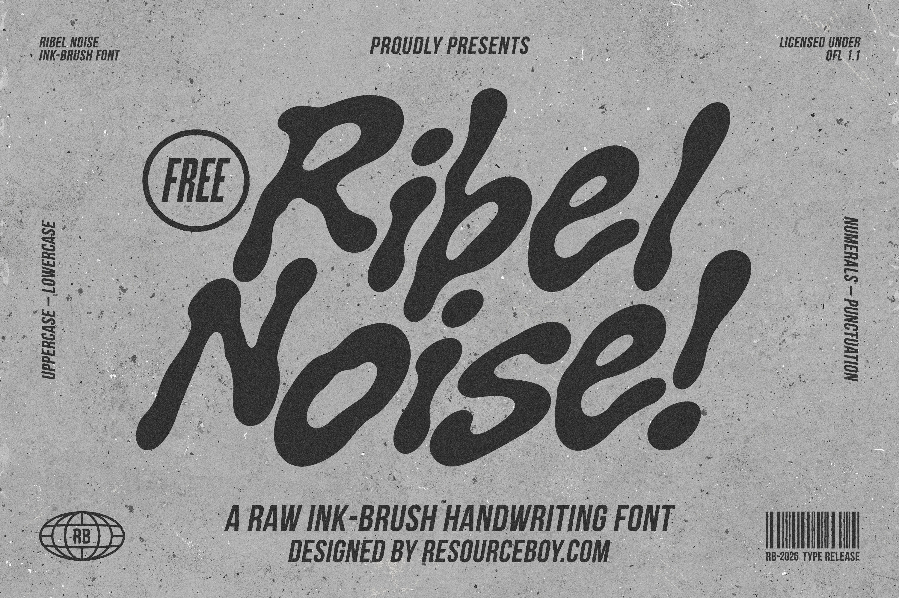
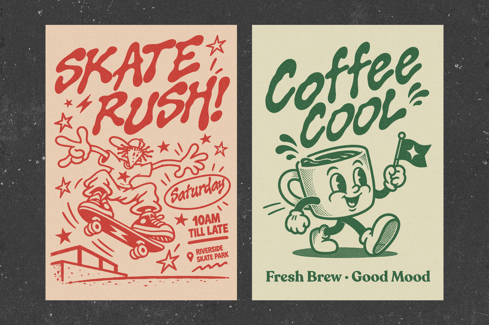
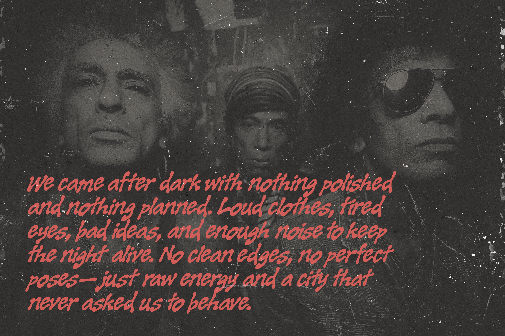
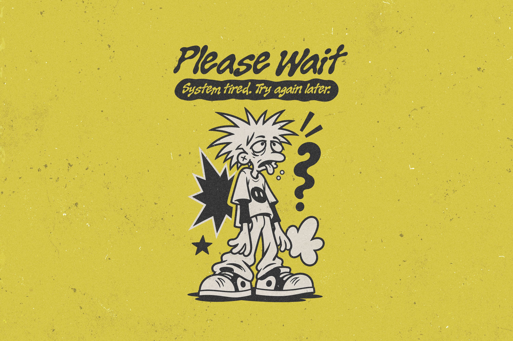
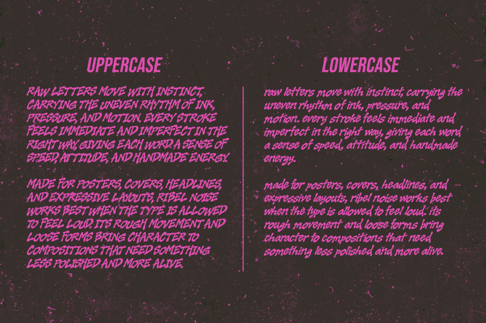
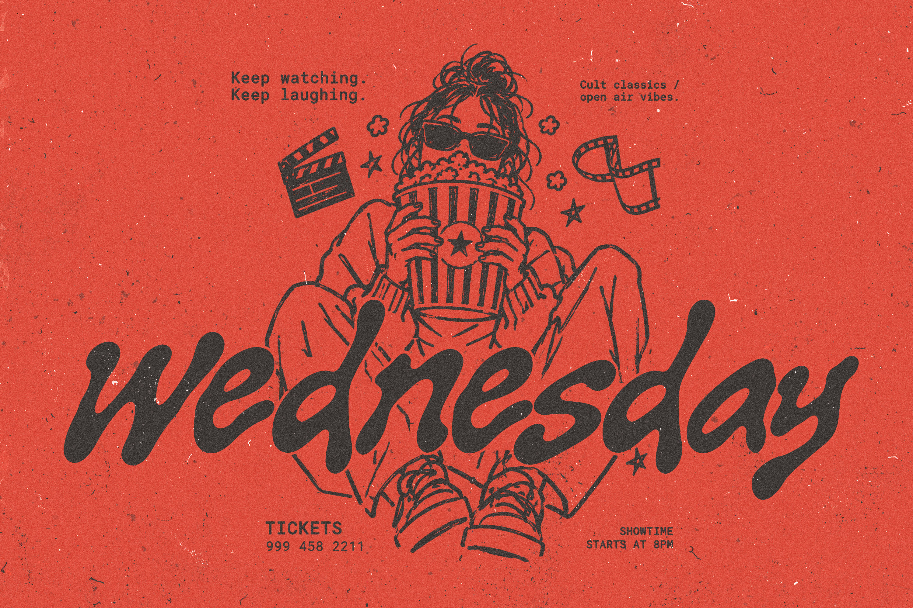

# Ribel Noise

**Ribel Noise** is an original ink-brush handwriting typeface designed by **Shahab Ahmadi** and published by **Resource Boy**.

Built around loose, expressive strokes and an intentionally imperfect rhythm, Ribel Noise brings a raw handmade character to posters, album covers, branding, editorial layouts, apparel, and other bold visual work. The font includes uppercase and lowercase letters, numerals, punctuation, currency symbols, and additional special characters.

[View Ribel Noise on Resource Boy](https://resourceboy.com/fonts/ribel-noise-font/)

## Font Style

Ribel Noise includes one style:

- Regular 400

## Preview

## Installation

Download `RibelNoise-Regular.ttf` from the `fonts` folder and install it on your system.

## License

Ribel Noise is licensed under the **SIL Open Font License, Version 1.1**.

You are free to use, study, modify, and redistribute the font under the terms of the license.

See [OFL.txt](OFL.txt) for the full license text.

## Designer

**Shahab Ahmadi**

## Publisher

**Resource Boy**

[resourceboy.com](https://resourceboy.com/)

[View the Ribel Noise font page](https://resourceboy.com/fonts/ribel-noise-font/)

---

Copyright © 2026 Resource Boy